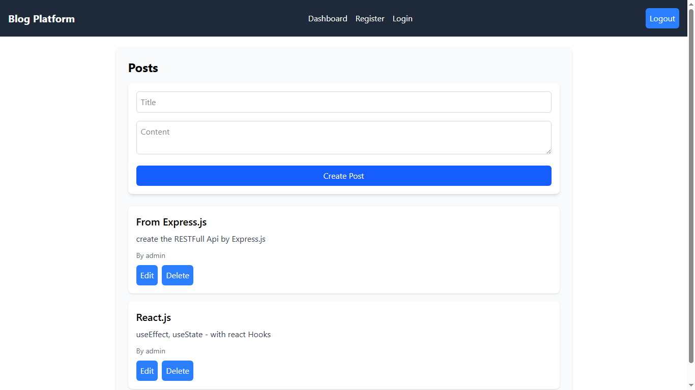

## Blog Platform Client

## 📸 Screenshots



### English

This is the client-side application for the Blog Platform project. Built with React and Vite, it provides a fast and modern interface for users to read, create, and manage blog posts.

#### Features

- User authentication and registration
- Create, edit, and delete blog posts
- Responsive and user-friendly UI
- Fast development with Vite and React

#### Getting Started

1. Clone the repository:
   ```bash
   git clone https://github.com/yourusername/blog-platform-client.git
   ```
2. Install dependencies:
   ```bash
   npm install
   ```
3. Start the development server:
   ```bash
   npm run dev
   ```

#### Technologies Used

- React
- Vite
- JavaScript (ES6+)
- CSS/SCSS

---

### O‘zbekcha

Bu Blog Platform loyihasining mijoz (client) qismi hisoblanadi. React va Vite yordamida yaratilgan bo‘lib, foydalanuvchilarga blog postlarini o‘qish, yaratish va boshqarish imkonini beradi.

#### Xususiyatlari

- Foydalanuvchi autentifikatsiyasi va ro‘yxatdan o‘tish
- Blog postlarini yaratish, tahrirlash va o‘chirish
- Moslashuvchan va qulay interfeys
- Vite va React bilan tezkor ishlash

#### Boshlash

1. Repodan nusxa oling:
   ```bash
   git clone https://github.com/yourusername/blog-platform-client.git
   ```
2. Kerakli paketlarni o‘rnating:
   ```bash
   npm install
   ```
3. Dastur serverini ishga tushiring:
   ```bash
   npm run dev
   ```

#### Texnologiyalar

- React
- Vite
- JavaScript (ES6+)
- CSS/SCSS

---
